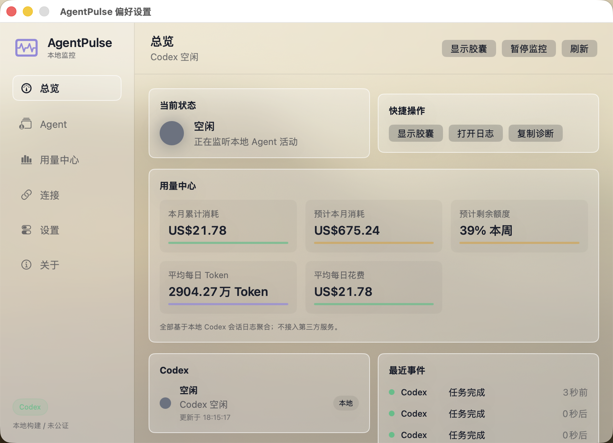
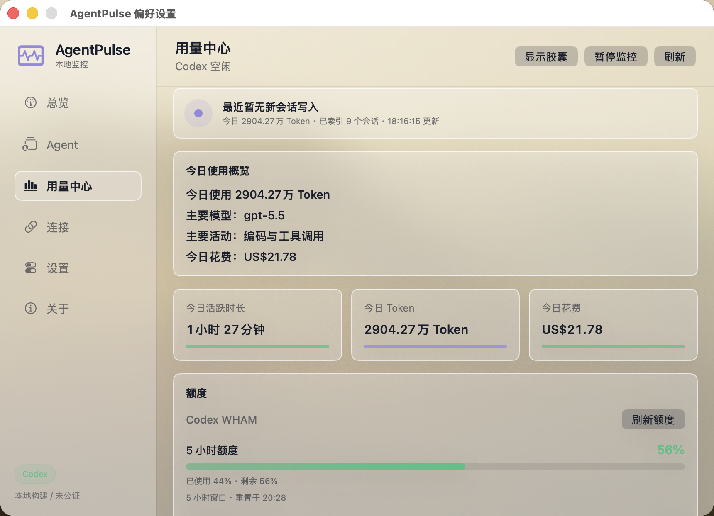
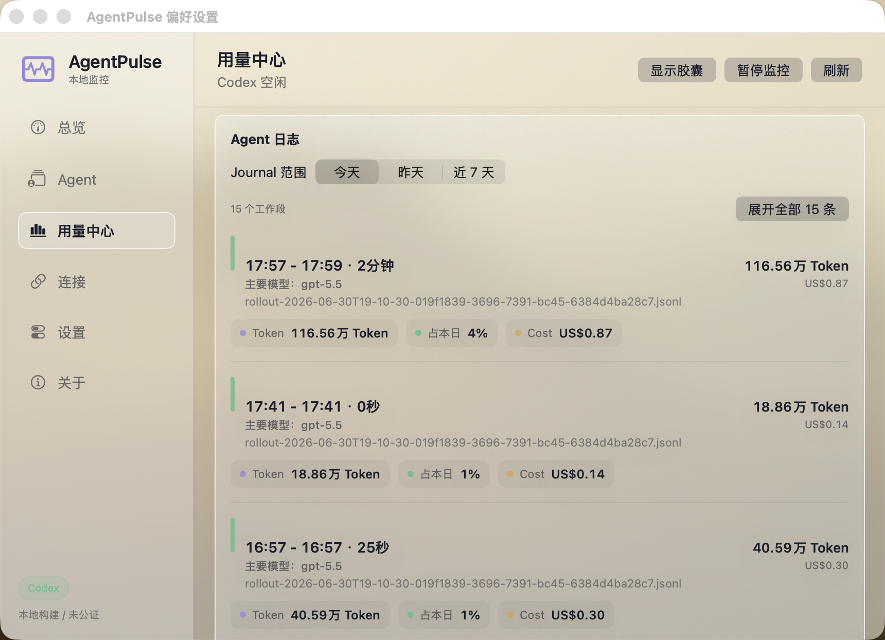
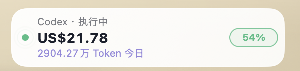
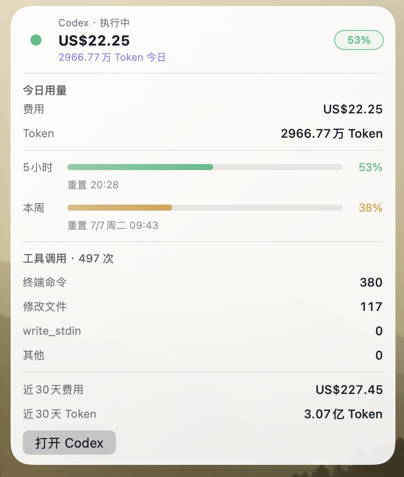
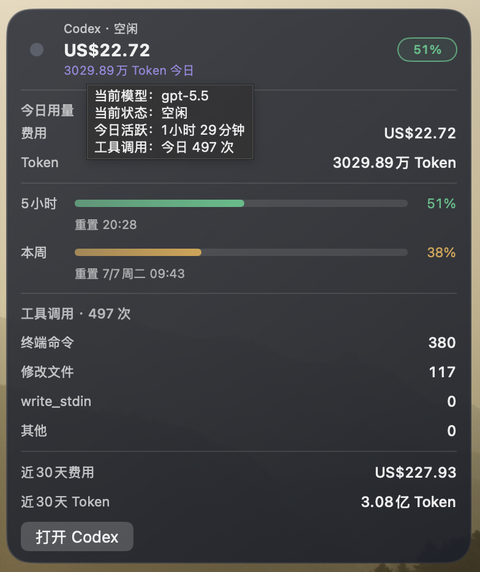
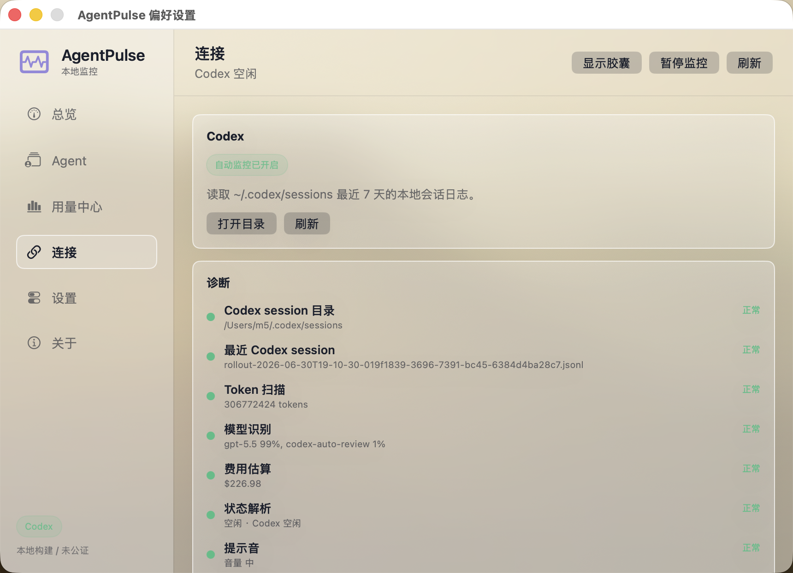

# AgentPulse

AgentPulse 是一个原生 macOS 菜单栏应用，用来观察本地 AI Agent 的运行状态、Codex 用量、额度消耗和最近工作记录。

它关注的是一个很直接的问题：

> 今天 Agent 到底帮我做了多少事？用了多少 Token？花了多少钱？现在还在不在工作？

AgentPulse 不依赖云端服务，不上传你的会话日志，也不使用 LLM 总结你的内容。它只读取本机已有的数据，把 Codex 和 Claude 的活动整理成更容易理解的本地监控视图。



## 亮点

### 本地优先

AgentPulse 默认从本机读取数据：

- Codex：读取 `~/.codex/sessions` 本地会话日志
- Claude：通过可选 Claude Code Hook 写入本地状态事件

所有数据都保留在你的 Mac 上。

### 更像“使用故事”的 Usage Center

用量中心不是简单堆指标，而是把今天的使用情况整理成用户能快速理解的信息：

- 今日活跃时长
- 今日 Token
- 今日花费
- 主要模型
- 主要活动
- 额度剩余
- 工具调用
- Agent Journal



### Agent Journal

Agent Journal 会把 Codex 的本地 JSONL 事件整理成“工作段”。

这比按文件展示更符合实际使用感受。你可以看到每一段 Codex 工作的开始时间、结束时间、持续时间、Token 和 Cost。

支持：

- 今天
- 昨天
- 最近 7 天
- 展开 / 收起
- 按日期分组
- 每段显示 Token、Cost、模型和来源文件



### Codex Quota

AgentPulse 会优先读取 Codex WHAM 实时额度。

它会显示：

- 5 小时额度剩余
- 5 小时窗口重置时间
- 本周额度剩余
- 本周重置时间

如果额度数据暂时不可用，AgentPulse 会明确显示未知状态，而不是把未知误显示为 `0%`。

### Model Usage

Model Usage 展示不同模型的使用占比。

包括：

- 模型名称
- Token 数
- Cost
- 占比
- 横向占比条

模型名来自 Codex JSONL 里的真实 model 字段，不写死某个模型列表。

### Tool Calls

AgentPulse 会展示工具调用分布，帮助你理解 Codex 今天主要在做什么。

当前分类包括：

- Bash
- Read
- Edit
- Write
- Search
- Web
- Other

0 次调用的工具不会显示，界面会保持简洁。

### Claude 状态监测

AgentPulse 支持通过 Claude Code Hooks 监测 Claude 状态。

Claude 当前只做状态监测，不承诺 Token / Cost。

Claude 视图会展示：

- 当前状态
- Hook 是否已安装
- 工具事件数量
- 最近 Hook 活动

如果 Claude Hook payload 中没有可用 usage 信息，界面会明确提示：

```text
Claude 暂未提供可用 token 数据
```

### 悬浮胶囊

悬浮胶囊用于快速查看当前 Agent 状态。



当 Codex 和 Claude 同时启用时，AgentPulse 会按优先级展示最重要的状态：

```text
attention > working > thinking > done > idle
```

展开后可以看到各个 Agent 的状态。Codex 会显示用量和额度；Claude 会显示状态监测信息，不会显示虚假的 Token 或 Cost。

胶囊支持紧凑和展开两种状态。紧凑状态适合长期悬浮在屏幕边缘，只保留状态、今日费用、今日 Token 和额度；展开状态会显示更完整的用量、额度、工具调用和近 30 天数据。



### 浅色和深色模式

AgentPulse 支持跟随系统外观，也可以在偏好设置中手动选择浅色或深色。

浅色模式更接近 macOS 的玻璃质感和低干扰背景，适合日常使用；深色模式会降低大面积亮度，在夜间或长时间编码时更舒适。



### 连接与诊断

连接页面用于确认本地数据是否正常读取。

你可以看到：

- Codex session 目录是否存在
- 最近 Codex session 文件
- Token 扫描是否正常
- 模型识别是否正常
- 费用估算是否正常
- 状态解析是否正常



## 功能概览

| 模块 | 能力 |
| --- | --- |
| Dashboard | 当前状态、快捷操作、最近事件 |
| Agent | Codex 监控开关、Claude Hook 安装与卸载 |
| Usage Center | Codex 用量、额度、模型、工具、Journal、趋势 |
| Connections | 本地数据源、诊断、日志目录 |
| Preferences | 外观、提示音、启动项、隐私模式 |
| About | 检查更新、打开下载页面、项目主页 |

## 安装

从 GitHub Releases 下载最新版：

[AgentPulse Releases](https://github.com/AtoposAC/AgentPulse/releases)

下载 `AgentPulse.dmg` 后打开，将应用拖入 Applications 即可。

当前更新检查会下载并打开 DMG，由用户手动替换应用。等接入 Developer ID 签名和公证后，可以进一步支持 Sparkle 自动更新。

## 如何更新

AgentPulse 目前使用 GitHub Releases 分发，不会自动替换正在运行的 App。

1. 在 AgentPulse 的 About 页面点击“检查更新”。
2. 如果发现新版本，AgentPulse 会显示当前版本、最新版本、Release 页面和 DMG 名称。
3. 下载完成后会自动打开 DMG。
4. 关闭正在运行的 AgentPulse。
5. 将 DMG 中的新版本拖拽到 Applications，覆盖旧版本。

如果下载失败，也可以直接打开 [Releases 页面](https://github.com/AtoposAC/AgentPulse/releases) 手动下载最新的 `AgentPulse.dmg`。

## 构建

需要 macOS 14 或更高版本。

```bash
swift build -c release --disable-sandbox
```

打包 App：

```bash
./script/package-app.sh
```

打包 DMG：

```bash
./script/package-dmg.sh
```

## CLI

AgentPulse 附带本地诊断 CLI。

常用命令：

```bash
.build/debug/agentpulse-cli status
.build/debug/agentpulse-cli diagnostics
.build/debug/agentpulse-cli scan-usage
.build/debug/agentpulse-cli diagnose-codex
.build/debug/agentpulse-cli diagnose-quota
.build/debug/agentpulse-cli diagnose-quota-raw
.build/debug/agentpulse-cli diagnose-claude-hook
.build/debug/agentpulse-cli test-claude-hook
.build/debug/agentpulse-cli install-claude-hook
.build/debug/agentpulse-cli uninstall-claude-hook
.build/debug/agentpulse-cli export-journal --days 7
```

其中 `scan-usage` 会输出 Codex 每日用量、模型用量和最近 Journal 工作段，适合排查本地数据扫描是否正常。
`export-journal --days 7` 会把最近 7 天的 Agent Journal 以 Markdown 输出，适合归档或排查工作段。

## 数据来源

### Codex

Codex 数据来自：

```text
~/.codex/sessions
```

AgentPulse 会扫描本地 JSONL 文件，提取 usage、model、tool call、时间戳等信息。

### Claude

Claude 状态来自可选的 Claude Code Hook。

Hook 安装后会写入：

```text
~/Library/Application Support/AgentPulse/logs/claude-hook.jsonl
```

AgentPulse 监听这个文件，并把 Hook 事件映射为 Claude 状态。

## 隐私

AgentPulse 是本地优先应用。

- 不上传 Codex 会话日志
- 不上传 Claude Hook 日志
- 不接入第三方分析服务
- 不使用 LLM 总结你的日志
- Usage Center 只展示本地扫描到的数据

Claude Hook 写入的是本地 Application Support 目录，用户可以随时卸载。

## 当前限制

- Claude 当前只支持状态监测，不支持稳定 Token / Cost 统计。
- Codex 用量依赖本地 JSONL 中是否存在 usage 字段。
- Quota 实时数据依赖 Codex WHAM 接口可用性。
- 当前更新方式是下载并打开 DMG，不是自动替换应用。

## Roadmap

- Claude Hook 兼容性验证
- CLI diagnostics 口径统一
- Journal 导出
- README 截图和使用示例补充
- Sparkle 自动更新
- Claude usage 可用则显示
- 更多 Agent 接入

## License

See [LICENSE](LICENSE).
